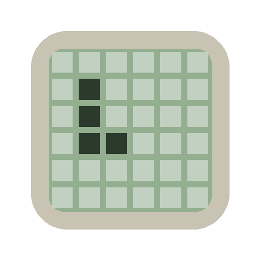

# BRICK GAME · 9999 IN 1

A faithful Progressive Web App recreation of the classic 90s/2000s handheld **Brick Game** LCD devices.

**Play live:** https://ipaliog-a11y.github.io/handheld_g/



## Features

- Authentic beige handheld shell + green LCD look
- **8 classic games:**
  - **A** BRICK – Classic Tetris
  - **B** BRICK B – Tetris with garbage rows
  - **C** RACE – Car dodging
  - **D** SNAKE
  - **E** SHOOT – Vertical block shooter
  - **F** TANK – Battle City lite
  - **G** BREAK – Breakout / Arkanoid
  - **H** FROG – Frogger
- Level (1–9) + Speed (1–9) select
- High scores saved per mode
- Simple LCD-style beep sounds
- Full offline PWA (installable on phone)
- English + Greek language
- Green LCD palette option
- Touch-friendly **Slide** layout (big L/R buttons)

## Controls

| Input | Action |
|-------|--------|
| D-pad / WASD / Arrows | Move / steer |
| A / Z / J | Rotate / Action |
| B / X / K | Hard drop / Shoot |
| START / Enter / Space | Start / Pause / Confirm |
| SET | Open settings |
| RESET / R | Back to menu |
| SOUND / M | Toggle sound |

### Settings (SET button)

| Option | Description |
|--------|-------------|
| **SLIDE** | Bigger left/right-only buttons (touch-friendly). Default OFF |
| **HOLD** | Hold button to auto-repeat |
| **GHOST** | Tetris landing preview piece |
| **GREEN** | Pure classic green LCD colours |
| **SOUND** | Beeps on/off |
| **LANG** | English / Ελληνικά |

## Install as app (phone)

1. Open the live link in Chrome / Safari
2. Tap **Add to Home Screen** / **Install**
3. Launch like a native app (fullscreen, offline)

## Tech

- Single-file HTML + Canvas
- Vanilla JS (no frameworks)
- Service Worker for offline
- `localStorage` for high scores & settings
- VT323 pixel font

## Development

Just open `index.html` or serve the folder:

```bash
npx serve .
```

## License

MIT – made for fun and nostalgia.
